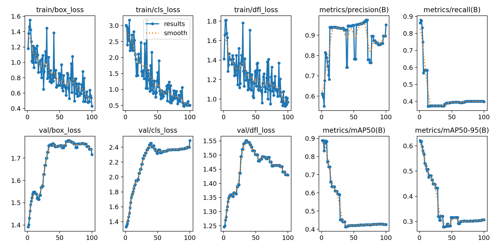

# Финальный отчёт по обучению модели YOLOv11 для распознавания блюд

---

## 1. Подготовка данных

- Скачано видео и извлечены кадры (около 700 изображений).
- Ручная аннотация 229 изображений с помощью Roboflow (классы: alcohol, meat, salat, soup, tea).
- Разбиение на train/val/test с пропорциями примерно 70/15/15.
- Проведена аугментация данных для повышения разнообразия.
- Экспорт датасета из Roboflow в формате YOLOv11.

---

## 2. Параметры обучения и причины выбора

| Параметр          | Значение                          | Комментарий                                      |
|-------------------|---------------------------------|-------------------------------------------------|
| Модель            | YOLOv11s (small)                 | Баланс между скоростью и точностью               |
| Предобученная модель | Использована (transfer learning) | Для ускорения обучения и повышения качества     |
| Эпохи             | 50                              | Достаточно для сходимости на данном объёме данных |
| Размер изображений | 640×640                         | Стандартный размер для хорошего баланса          |
| Размер батча      | 8                               | С учётом ограничений CPU                          |
| Аппаратное обеспечение | CPU (AMD Ryzen 5 3500U)       | Отсутствие GPU, что увеличивает время обучения   |
| Время обучения    | ~10.3 часа                      | Длительное из-за отсутствия GPU                   |

---

## 3. Метрики качества модели

| Метрика       | Значение |
|---------------|----------|
| Precision     | 0.963    |
| Recall        | 0.96     |
| mAP@0.5       | 0.965    |
| mAP@0.5:0.95  | 0.861    |

---

## 4. Результаты по классам

| Класс   | Precision | Recall | mAP50  | mAP50-95 |
|---------|-----------|--------|--------|----------|
| meat    | 0.985     | 1.0    | 0.995  | 0.983    |
| salat   | 0.993     | 1.0    | 0.995  | 0.991    |
| soup    | 0.945     | 0.905  | 0.962  | 0.603    |
| tea     | 0.931     | 0.933  | 0.908  | 0.866    |

---

## 5. Обучение и оптимизация гиперпараметров

- Отслеживались метрики: precision, recall, mAP@0.5, mAP@0.5:0.95, F1-score.
- Проведена одна полная итерация обучения.
- Планируется 1–2 итерации оптимизации гиперпараметров (learning rate, batch size, epochs).
- Текущие результаты показывают высокое качество, особенно по классам meat и salat.
- Для класса soup требуется улучшение.

---

## 6. Анализ ошибок и сложности

- Основная сложность — длительная ручная аннотация и подготовка данных в Roboflow.
- Обучение на CPU занимает много времени (около 10 часов), что ограничивает быструю итерацию.
- Класс soup имеет меньшую точность, возможно из-за меньшего количества и разнообразия данных.
- Использован подход transfer learning для ускорения обучения и повышения качества.

---

## 7. Графики метрик

В папке `runs/detect/train/plots/` сохранены графики:

- **Loss** (box_loss, cls_loss, dfl_loss): показывает снижение ошибки по координатам боксов, классификации и распределению.
- **mAP**: средняя точность по порогам IoU.
- **Precision и Recall**: точность и полнота распознавания.

*График обучения:*

---

## 8. Выводы и рекомендации

- Модель достигла высоких метрик (mAP@0.5 = 0.965), особенно хорошо распознаёт meat и salat.
- Для soup требуется больше данных и аугментаций.
- Рекомендуется использовать GPU для ускорения обучения.
- Следует провести 1–2 итерации оптимизации гиперпараметров.
- Планируется интеграция модели через Roboflow API для реального применения.

---

## 9. Время выполнения задания

- Около 12 часов, включая подготовку данных, аннотацию, обучение и анализ.

---

## 10. Опыт работы с YOLO

- Работа с YOLOv11 и Roboflow впервые.
- Процесс обучения и настройки модели стал ценным практическим опытом.

---

## 11. Используемые библиотеки (requirements.txt)

ultralytics
opencv-python
pandas
matplotlib
roboflow

text

---

## 12. Пример кода для инференса

from ultralytics import YOLO

model = YOLO('runs/detect/train/weights/best.pt')
results = model.predict('test_image.jpg', imgsz=640)
results.show()